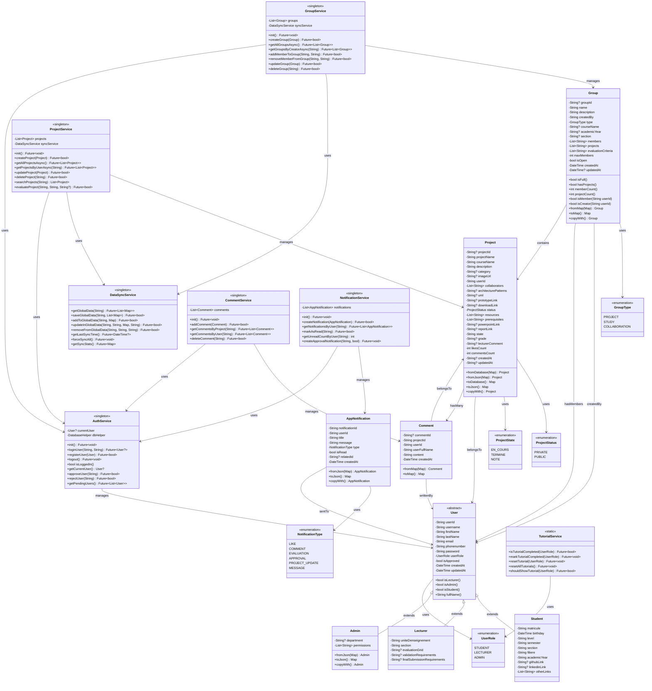

# Diagramme de Classes - Application CampusWork

## 📊 DIAGRAMME DE CLASSES UML

## 📋 DESCRIPTION DES CLASSES

### **Classes Modèles (Domain Layer)**

#### **User (Classe Abstraite)**
- **Rôle** : Classe de base pour tous les utilisateurs
- **Attributs** : Informations communes (nom, email, mot de passe, etc.)
- **Méthodes** : Getters pour vérifier le type d'utilisateur

#### **Student, Lecturer, Admin**
- **Rôle** : Spécialisations de User avec attributs spécifiques
- **Student** : Informations académiques (matricule, niveau, filière)
- **Lecturer** : Informations d'enseignement (unité, grille d'évaluation)
- **Admin** : Permissions et département

#### **Project**
- **Rôle** : Représente un projet académique
- **Attributs** : Détails du projet, collaborateurs, ressources, évaluation
- **Méthodes** : Conversion JSON/Database, copie avec modifications

#### **Group**
- **Rôle** : Représente un groupe de travail
- **Attributs** : Membres, projets associés, critères d'évaluation
- **Méthodes** : Gestion des membres, vérifications d'état

#### **Comment**
- **Rôle** : Commentaire sur un projet
- **Attributs** : Contenu, auteur, projet associé

#### **AppNotification**
- **Rôle** : Notification système
- **Attributs** : Type, message, statut de lecture

### **Classes Services (Business Layer)**

#### **AuthService (Singleton)**
- **Rôle** : Gestion de l'authentification et des utilisateurs
- **Fonctionnalités** : Login, register, approbation, gestion des sessions

#### **DataSyncService (Singleton)**
- **Rôle** : Synchronisation globale des données
- **Fonctionnalités** : Stockage partagé, synchronisation temps réel

#### **ProjectService (Singleton)**
- **Rôle** : Gestion des projets
- **Fonctionnalités** : CRUD projets, recherche, évaluation

#### **GroupService (Singleton)**
- **Rôle** : Gestion des groupes
- **Fonctionnalités** : CRUD groupes, gestion des membres

#### **CommentService (Singleton)**
- **Rôle** : Gestion des commentaires
- **Fonctionnalités** : CRUD commentaires, association aux projets

#### **NotificationService (Singleton)**
- **Rôle** : Gestion des notifications
- **Fonctionnalités** : Création, envoi, marquage comme lu

#### **TutorialService (Static)**
- **Rôle** : Gestion des tutoriels par rôle
- **Fonctionnalités** : Suivi de progression, réinitialisation

## 🔗 RELATIONS PRINCIPALES

### **Héritage**
- `User` ← `Student`, `Lecturer`, `Admin`

### **Composition/Agrégation**
- `Project` contient `Comment` (1:N)
- `Group` contient `Project` (N:N)
- `Group` contient `User` comme membres (N:N)

### **Associations**
- `Project` → `User` (créateur)
- `Comment` → `User` (auteur)
- `Comment` → `Project` (projet commenté)
- `AppNotification` → `User` (destinataire)

### **Dépendances de Services**
- Tous les services → `AuthService` (authentification)
- `ProjectService`, `GroupService` → `DataSyncService` (synchronisation)

## 🏗️ PATTERNS ARCHITECTURAUX

### **Singleton Pattern**
- Tous les services principaux (AuthService, ProjectService, etc.)

### **Factory Pattern**
- Méthodes `fromJson()`, `fromMap()`, `fromDatabase()`

### **Repository Pattern**
- Services agissent comme repositories pour leurs modèles

### **Observer Pattern**
- DataSyncService pour la synchronisation globale

Cette architecture respecte les principes SOLID et facilite la maintenance, les tests et l'évolution de l'application.