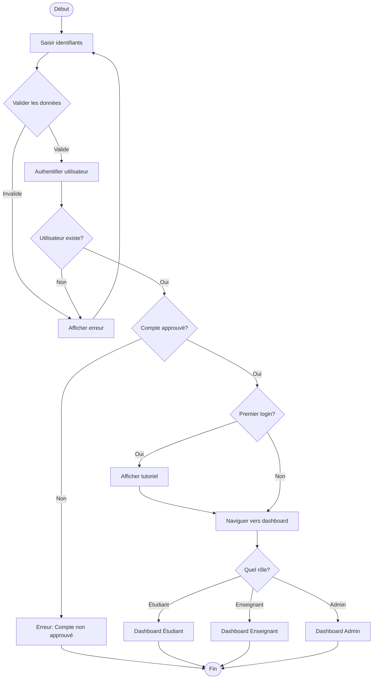
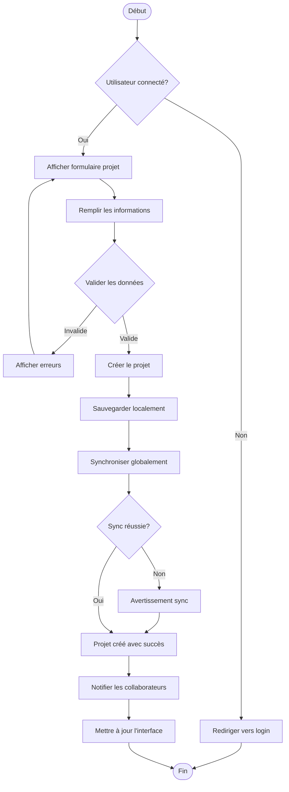
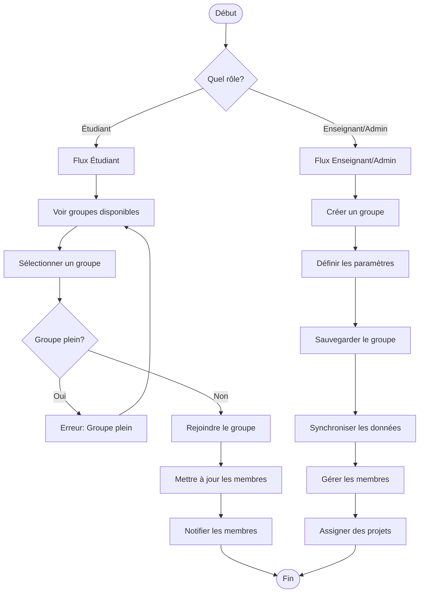
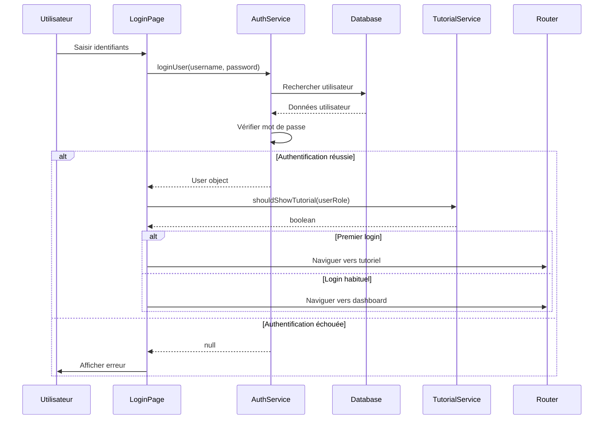
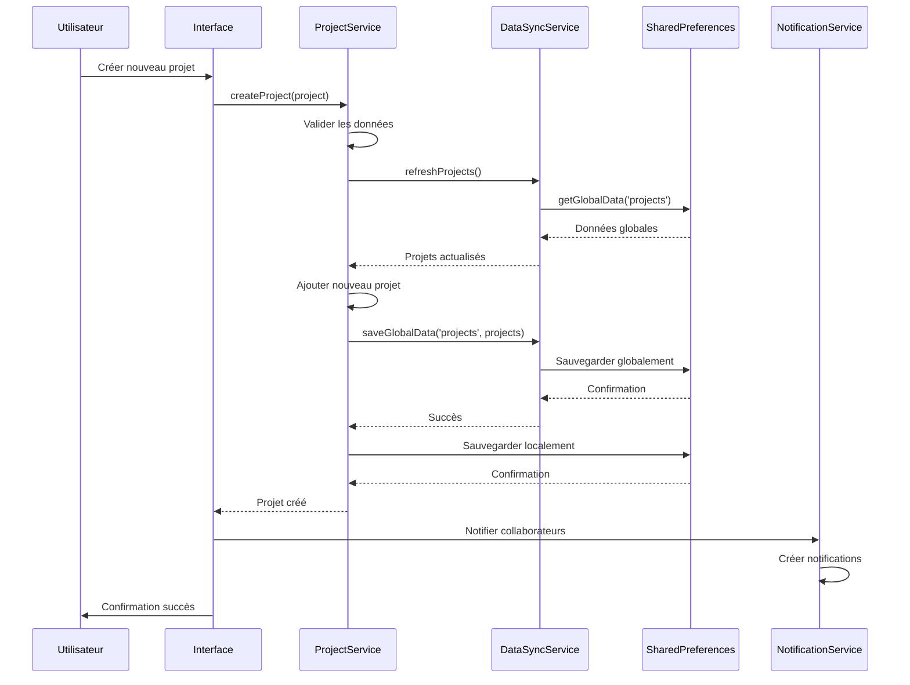
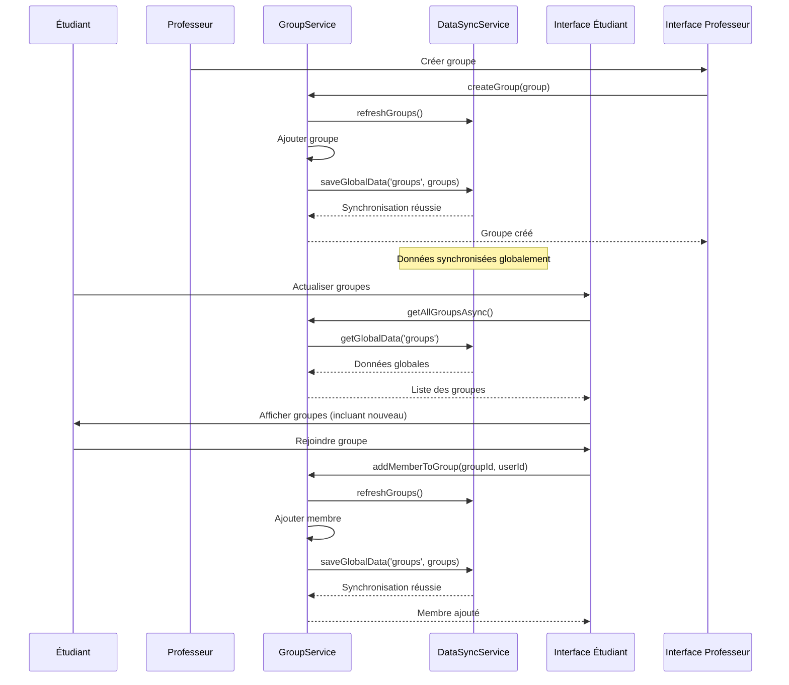
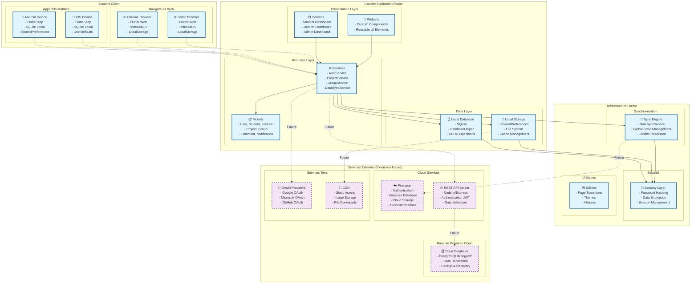
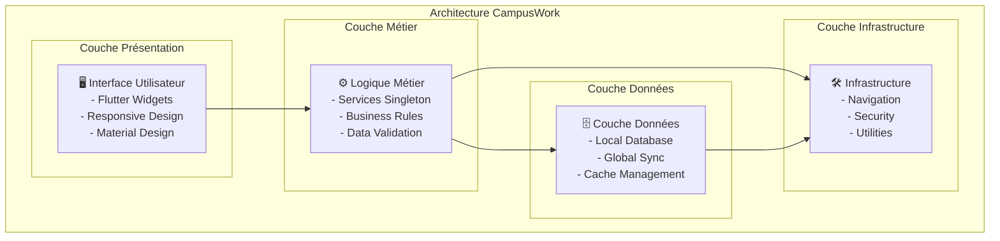

# Diagrammes UML Complets - Application CampusWork

## 🎯 DIAGRAMME DE CAS D'UTILISATION

```mermaid
graph TB
    %% Acteurs
    Student[👨‍🎓 Étudiant]
    Lecturer[👨‍🏫 Enseignant]
    Admin[👨‍💼 Administrateur]
    System[🖥️ Système]

    %% Cas d'utilisation - Authentification
    subgraph "Authentification"
        UC1[S'inscrire]
        UC2[Se connecter]
        UC3[Se déconnecter]
        UC4[Réinitialiser mot de passe]
    end

    %% Cas d'utilisation - Gestion des projets
    subgraph "Gestion des Projets"
        UC5[Créer un projet]
        UC6[Modifier un projet]
        UC7[Supprimer un projet]
        UC8[Consulter les projets]
        UC9[Rechercher des projets]
        UC10[Évaluer un projet]
        UC11[Commenter un projet]
        UC12[Liker un projet]
    end

    %% Cas d'utilisation - Gestion des groupes
    subgraph "Gestion des Groupes"
        UC13[Créer un groupe]
        UC14[Rejoindre un groupe]
        UC15[Quitter un groupe]
        UC16[Gérer les membres]
        UC17[Assigner des projets]
    end

    %% Cas d'utilisation - Administration
    subgraph "Administration"
        UC18[Approuver les inscriptions]
        UC19[Gérer les utilisateurs]
        UC20[Consulter les statistiques]
        UC21[Modérer le contenu]
        UC22[Créer des annonces]
    end

    %% Cas d'utilisation - Communication
    subgraph "Communication"
        UC23[Envoyer des notifications]
        UC24[Créer des sondages]
        UC25[Répondre aux sondages]
        UC26[Consulter le feed]
    end

    %% Relations Étudiant
    Student --> UC1
    Student --> UC2
    Student --> UC3
    Student --> UC5
    Student --> UC6
    Student --> UC7
    Student --> UC8
    Student --> UC9
    Student --> UC11
    Student --> UC12
    Student --> UC14
    Student --> UC15
    Student --> UC25
    Student --> UC26

    %% Relations Enseignant
    Lecturer --> UC2
    Lecturer --> UC3
    Lecturer --> UC8
    Lecturer --> UC9
    Lecturer --> UC10
    Lecturer --> UC11
    Lecturer --> UC13
    Lecturer --> UC16
    Lecturer --> UC17
    Lecturer --> UC24
    Lecturer --> UC26

    %% Relations Administrateur
    Admin --> UC2
    Admin --> UC3
    Admin --> UC18
    Admin --> UC19
    Admin --> UC20
    Admin --> UC21
    Admin --> UC22
    Admin --> UC8
    Admin --> UC13

    %% Relations Système
    System --> UC4
    System --> UC23

    %% Inclusions et Extensions
    UC2 -.->|<<include>>| UC4
    UC5 -.->|<<extend>>| UC17
    UC13 -.->|<<include>>| UC16
```

## 🔄 DIAGRAMMES D'ACTIVITÉ

### **Activité 1 : Processus de Connexion**

### **Activité 2 : Création d'un Projet**

### **Activité 3 : Gestion des Groupes**

## 📋 DIAGRAMMES DE SÉQUENCE

### **Séquence 1 : Authentification Utilisateur**

### **Séquence 2 : Création et Synchronisation de Projet**

### **Séquence 3 : Gestion des Groupes avec Synchronisation**

## 🏗️ DIAGRAMME DE DÉPLOIEMENT

## 📊 DIAGRAMME D'ARCHITECTURE SYSTÈME

## 🔄 PATTERNS DE DÉPLOIEMENT

### **Pattern 1 : Architecture Locale (Actuelle)**
- **Avantages** : Pas de dépendance réseau, données privées, performance
- **Inconvénients** : Synchronisation limitée, pas de backup cloud

### **Pattern 2 : Architecture Hybride (Future)**
- **Avantages** : Meilleur des deux mondes, synchronisation cloud
- **Inconvénients** : Complexité accrue, gestion des conflits

### **Pattern 3 : Architecture Cloud-First (Extension)**
- **Avantages** : Synchronisation temps réel, backup automatique
- **Inconvénients** : Dépendance réseau, coûts d'infrastructure

## 📱 DÉPLOIEMENT MULTI-PLATEFORME

### **Plateformes Supportées**
- ✅ **Android** (API 21+)
- ✅ **iOS** (iOS 11+)
- ✅ **Web** (Chrome, Safari, Firefox)
- 🔄 **Desktop** (Windows, macOS, Linux) - Future

### **Stratégie de Déploiement**
1. **Phase 1** : Application mobile native (Android/iOS)
2. **Phase 2** : Version web responsive
3. **Phase 3** : Applications desktop
4. **Phase 4** : Intégration cloud et services externes

Cette architecture modulaire et évolutive permet une croissance progressive de l'application tout en maintenant la qualité et la performance.